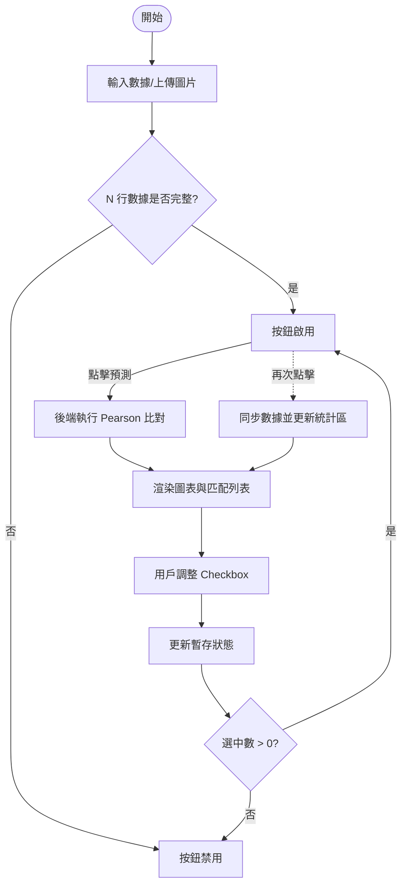

這是一份完整且結構化的 **PRD (產品需求文件)**，採用 Markdown 格式編寫，方便你直接貼入專案文檔或 GitHub Wiki。

---

# 📄 產品需求文件 (PRD)：AI 歷史走勢匹配與預測系統

## 1. 產品概述
本系統是一個專業的金融技術分析工具，旨在透過「歷史相似性」來輔助交易決策。用戶提供目前的 K 線走勢，系統利用 **Pearson 相關係數** 在歷史資料庫中尋找相似片段，並統計這些片段後的「真實走勢」，產出預測情境。

---

## 2. 核心功能與邏輯 (Core Logic)

### 2.1 數據準備階段 (Data Prep Phase)
*   **N 行樣本定義：** 用戶需設定回溯的 K 棒數量 $N$（如：最近 20 根）。
*   **雙軌輸入機制：**
    *   **自動化：** 支持 CSV 上傳或 K 線截圖（透過 Vision AI 辨識 OHLC）。
    *   **手動保底：** 若自動辨識失敗，用戶可手動在編輯器中輸入或修正數據。
*   **按鈕鎖定邏輯 (Validation)：**
    *   **預測按鈕 (PredictBtn)** 初始狀態為 `Disabled`。
    *   只有當 $N$ 行數據（Open, High, Low, Close）全部填寫完整且數值合法時，按鈕才轉為 `Enabled`。

### 2.2 結果調整階段 (Refinement Phase - Scenario D)
*   **批次更新邏輯：**
    *   當用戶在「匹配列表」中勾選或取消勾選案例時，系統**僅更新暫存狀態 (tempSelection)**。
    *   **右側結果區 (Stats & Forecast) 保持凍結**，不隨勾選即時連動，以維持介面穩定性。
*   **二次鎖定邏輯：**
    *   若用戶將所有案例取消勾選（Count = 0），**預測按鈕** 立即轉為 `Disabled`，防止空數據計算。
*   **同步更新觸發：**
    *   用戶必須再次點擊「開始預測」，系統才會將目前的勾選狀態同步至結果區，重新計算統計指標與更新圖表。

---

## 3. UI 佈局規範 (Layout Suggestion)

系統採用 **SPA (單頁式應用)** 佈局，建議使用 **Dark Mode** 以符合金融交易工具之專業感。

### 3.1 頂部：輸入與配置區 (Input Bar)
*   **左側：** 檔案上傳組件（Drag & Drop Zone）。
*   **右側：** Timeframe 下拉選單、N 值輸入框。

### 3.2 中部：編輯與主視覺區 (Main Content)
*   **左側 (Dynamic Editor)：** 
    *   $N$ 行 OHLC 編輯表格。
    *   底部放置顯眼的 **[▶ 開始預測]** 動作按鈕。
*   **右側 (Interactive Chart)：**
    *   顯示目前走勢與匹配成功的歷史走勢線條。
    *   **關鍵視覺：** 使用一條「垂直橘色虛線」區隔「歷史比對區（過去）」與「走勢預測區（未來）」。

### 3.3 底部：結果分析區 (Result Gallery)
*   **左側 (Match List)：** 
    *   卡片式列表，顯示相似度 $r$。
    *   每張卡片附帶 Checkbox。取消勾選時，卡片透明度降至 50%。
*   **右側 (Analytics Dashboard)：**
    *   **統計指標：** 平均相關係數、勝率、收益標準差。
    *   **情境預測卡片：** 樂觀 (Bullish)、基準 (Base)、悲觀 (Bearish) 的目標價位。

---

## 4. 用戶場景流程 (User Scenarios)

### Scenario A: 成功路徑 (Happy Flow)
1. 用戶設定 $N=15$ 並上傳截圖。
2. Vision AI 填充 15 行數據，按鈕解鎖。
3. 用戶點擊「開始預測」，右側出現 10 組匹配結果。
4. 用戶取消其中 2 組異常案例，點擊「開始預測」更新統計，獲得最終預測目標價。

### Scenario B: 手動復原 (Manual Recovery)
1. 圖片辨識失敗，編輯器呈現空白 $N$ 行。
2. 用戶手動填入數據，填滿最後一格時，按鈕解鎖。

### Scenario C: 全取消鎖定 (Zero-Selection)
1. 用戶在結果區取消所有案例勾選。
2. 「開始預測」按鈕變為灰色禁用狀態，提示「請至少選擇一個案例」。

---

## 5. 非功能性需求 (Non-functional Requirements)
*   **視覺引導：** 當勾選狀態與目前顯示結果不一致時，統計區應顯示「⚠️ 數據已變更，請點擊更新」之提示。
*   **效能優化：** 統計計算與圖表重新渲染應在點擊按鈕後的 500ms 內完成。
*   **響應式設計：** 確保在不同尺寸的螢幕上（尤其是寬螢幕）編輯區與圖表能並排顯示。

---

## 6. 技術介面定義 (API Specification)

### POST `/api/predict`
*   **Payload:**
    *   `ohlc_data`: Array (Length N)
    *   `selected_ids`: Array (可為空，用於過濾歷史案例)
*   **Response:**
    *   `matches`: Array (包含歷史片段數據與相關係數)
    *   `stats`: Object (包含樂觀/基準/悲觀之數值)

---

## 7. 系統邏輯流程圖 (Mermaid)

