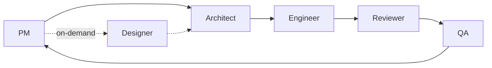

# K-Line Prediction

**Directing a team of AI coding agents to ship [a live K-line prediction web app](https://k-line-prediction-app.web.app) — six agents, one human operator, 40+ shipped tickets. Ten representative rules with their originating bugs in [`docs/agents-ruleset-highlights.md`](./docs/agents-ruleset-highlights.md).**

[](https://k-line-prediction-app.web.app)
[](https://vitejs.dev/)
[](https://fastapi.tiangolo.com/)
[](https://firebase.google.com/)
[](https://playwright.dev/)

## Before & After

<table>
<tr>
<td width="360"></td>
<td width="360"></td>
</tr>
<tr>
<td width="360"><strong>Before</strong> — basic single-column layout, no design system.</td>
<td width="360"><strong>After</strong> — sitewide design system, typography tokens, polished hero.</td>
</tr>
</table>

*Captured at SHA [`80e12d7`](https://github.com/mshmwr/K-Line-Prediction/commit/80e12d7) (v1) and [`058699b`](https://github.com/mshmwr/K-Line-Prediction/commit/058699b) (v2) on 2026-04-24, viewport 1440×900, scroll position 0.*

One human operator redesigned and shipped a 5-page portfolio site using a team of six AI agents — Product Manager, Architect, Engineer, Reviewer, QA, Designer — coordinated by per-role personas whose rules were each written after a specific ticket incident. 40+ tickets — each with scoped AC, design doc, implementation, review, QA pass, and retrospective — were driven through the pipeline between 2026-04-18 and 2026-04-24. The output: a redesigned, deployed site; a ruleset where each rule names the bug it was written to prevent; and this README, which itself triggered a new rule before shipping. Ten representative rules with their originating bugs are listed in [`docs/agents-ruleset-highlights.md`](./docs/agents-ruleset-highlights.md); full personas live in private Claude Code config. The product under the harness is a K-line pattern-matching tool for short-term ETH/USDT direction — a deliberately narrow testbed for the agent workflow. The same harness will drive the next iteration of the model.

**Stack:** React + TypeScript, FastAPI + Python, Playwright + Vitest, Firebase Hosting + Cloud Run.

## Role pipeline

Automatic handoffs between roles; operator checkpoints are explicit and named (see Content-Alignment Gate below).



<!-- ROLES:start -->
| Role | Owns | Artefact |
|---|---|---|
| PM | Requirements, AC, phase gating | PRD + ticket + retrospective |
| Architect | Design, API contract, component tree | Design doc + retrospective |
| Engineer | Implementation | Code + retrospective |
| Reviewer | Code review, Bug Found Protocol | Review report + retrospective |
| QA | Regression, E2E, visual report | QA report + retrospective |
| Designer | Pencil design source of truth | .pen file + JSON/PNG spec + retrospective |
<!-- ROLES:end -->

## Named artefacts

Each rule was written after a specific failure was observed during the build. Five examples:

- **Bug Found Protocol** — when a code reviewer finds a bug, the responsible role writes a short retrospective naming the root cause before any fix begins. Added after K-008, where the Engineer treated an environment variable as trusted input and shipped a path-traversal sink. See [docs/ai-collab-protocols.md §Bug Found Protocol](./docs/ai-collab-protocols.md#bug-found-protocol).
- **Content-Alignment Gate** — for any user-voice document (README, portfolio copy, CV), PM pauses the pipeline until the operator approves the verbatim draft. Added during K-044 when the first-pass README draft was about to be dispatched to Engineer without operator review.

  *Before — K-044 first pass, moments before user paused dispatch:*
  > PM: Architect draft returned. Subtitle reads "six agents, one human operator, a written rule system checked into this repo, 40+ shipped tickets". Content aligns with portfolio framing. Dispatching Engineer.

  *After — this commit, with the gate in place:*
  > PM: Architect draft returned. Surfacing verbatim to operator — subtitle, closing paragraph, 10-rule list — for alignment. Engineer not dispatched until operator responds.

  The Before subtitle was wrong: rules live in private Claude Code config (`~/.claude/agents/*.md`), not "checked into this repo". The gate caught the overclaim before it shipped. See [docs/ai-collab-protocols.md §Content-Alignment Gate](./docs/ai-collab-protocols.md#content-alignment-gate).
- **Deploy rebase-then-FF-merge** — before any deploy, every unmerged ticket branch is rebased onto the current main and then fast-forward merged in. Added 2026-04-24 after K-041 deployed from a main that had not absorbed a previously-deployed ticket's branch, overwriting that ticket's bundle.
- **Pencil as design source of truth** — only the Designer role edits the `.pen` design files; every other role reads the exported JSON + PNG. The code reviewer runs a line-by-line parity check between the design and the shipped component. Added during K-034 after shipped components kept diverging from the design without anyone noticing. See [docs/tickets/K-034](./docs/tickets/K-034-about-spec-audit-and-workflow-codification.md).
- **Locked marker block** — the role table in this README is wrapped in `<!-- ROLES:start -->` / `<!-- ROLES:end -->` markers and regenerated from a single JSON file. A pre-commit hook fails any commit where the table has drifted from that source. Added K-039 after the table appeared in three places (README, TSX, protocol doc) with no link back to a single source. See [docs/tickets/K-039](./docs/tickets/K-039-split-ssot-role-cards.md).

## The K-line prediction tool

This is the testbed the harness operates on. The deployed site predicts short-term ETH/USDT price direction by matching the current K-line pattern against historical patterns and reporting the consensus of the top-N nearest neighbors.

**→ Try the prediction tool: [k-line-prediction-app.web.app/app](https://k-line-prediction-app.web.app/app)**

## Future enhancements

- **Backtesting** — run the prediction engine across historical windows and report hit rate by market regime. Ticket open; not yet scheduled.
- **Architecture refinement** — further isolation of the `/app` mini-app from the portfolio chrome.

## Further reading

- [docs/agents-ruleset-highlights.md](./docs/agents-ruleset-highlights.md) — ten representative rules, each tagged with owning role and originating ticket
- [docs/ai-collab-protocols.md](./docs/ai-collab-protocols.md) — role pipeline, Bug Found Protocol, Content-Alignment Gate
- [docs/tickets/](./docs/tickets/) — 40+ tickets with PRD, AC, and retrospectives
- [docs/retrospectives/](./docs/retrospectives/) — per-role cumulative learning log

## Setup

```bash
git config core.hooksPath .githooks    # one-time after clone — enables role-doc drift gate
```

The pre-commit hook regenerates `README.md` and `docs/ai-collab-protocols.md` role tables from `content/roles.json` and rejects the commit on drift. Without this config, the gate is silently inactive.

## Local dev

```bash
cd frontend && npm install && npm run dev           # http://localhost:5173
cd backend && python3 -m venv .venv && source .venv/bin/activate
pip install -r requirements.txt && uvicorn main:app --reload  # http://localhost:8000
```

## Deploy

```bash
cd frontend && npm run build
firebase deploy --only hosting
```

## Testing

```bash
cd frontend && npx tsc --noEmit && npx vitest run && npx playwright test
cd backend && pytest
```
