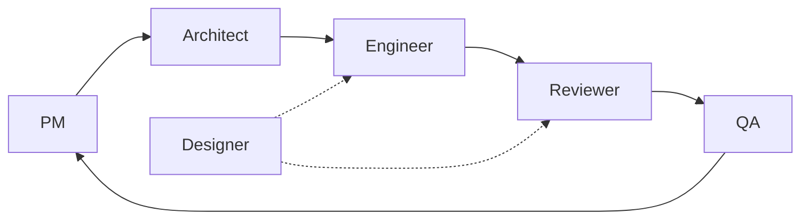

# K-Line Prediction

**A portfolio case study in harness engineering: six AI agents, one human operator, one written rule system, 30 shipped tickets.**

[](https://k-line-prediction-app.web.app)
[]()
[]()

## Before & After

<table>
<tr>
<td></td>
<td></td>
</tr>
</table>

*Captured at SHA `80e12d7` (v1) and `058699b` (v2) on 2026-04-24, viewport 1440×900, scroll position 0.*

## What this is

Over six weeks, one human operator redesigned and shipped a 5-page portfolio site using a team of six AI agents — Product Manager, Architect, Engineer, Reviewer, QA, Designer — coordinated by a written rule system checked into this repo. Thirty tickets were driven through the pipeline, with every role's rules versioned alongside the code they govern. The output: a redesigned, deployed site; a set of rules that caught specific bugs the rules were written to prevent; and this README, which itself triggered a new rule before shipping.

**Stack:** React + TypeScript, FastAPI + Python, Playwright + Vitest, Firebase Hosting + Cloud Run.

## Role pipeline

Automatic handoffs between roles; operator checkpoints are explicit and named (see Content-Alignment Gate below).



<!-- ROLES:start -->
| Role | Owns | Artefact |
|---|---|---|
| PM | Requirements, AC, phase gating | PRD + ticket + 反省 |
| Architect | Design, API contract, component tree | Design doc + 反省 |
| Engineer | Implementation | Code + 反省 |
| Reviewer | Code review, Bug Found Protocol | Review report + 反省 |
| QA | Regression, E2E, visual report | QA report + 反省 |
| Designer | Pencil design source of truth | .pen file + JSON/PNG spec + 反省 |
<!-- ROLES:end -->

## Named artefacts

Each rule was written after a specific failure was observed during the build. Five examples:

- **Bug Found Protocol** — when a code reviewer finds a bug, the responsible role writes a short retrospective naming the root cause before any fix begins. Added after K-008, where the Engineer treated an environment variable as trusted input and shipped a path-traversal sink. See [docs/ai-collab-protocols.md §Bug Found Protocol](./docs/ai-collab-protocols.md#bug-found-protocol).
- **Content-Alignment Gate** — for any user-voice document (README, portfolio copy, CV), Product Manager pauses the pipeline until the operator approves the verbatim draft. Added during K-044 after the first draft of this README was about to be sent to Engineer without operator review. See [docs/ai-collab-protocols.md §Content-Alignment Gate](./docs/ai-collab-protocols.md#content-alignment-gate).
- **Deploy rebase-then-FF-merge** — before any deploy, every unmerged ticket branch is rebased onto the current main and then fast-forward merged in. Added 2026-04-24 after K-041 deployed from a main that had not absorbed a previously-deployed ticket's branch, overwriting that ticket's bundle. See [CLAUDE.md §Deploy Checklist](./CLAUDE.md#deploy-checklist-firebase-hosting--cloud-run).
- **Pencil as design source of truth** — only the Designer role edits the `.pen` design files; every other role reads the exported JSON + PNG. The code reviewer runs a line-by-line parity check between the design and the shipped component. Added during K-034 after shipped components kept diverging from the design without anyone noticing. See [docs/tickets/K-034](./docs/tickets/K-034-about-spec-audit-and-workflow-codification.md).
- **Sacred marker block** — the role table in this README is wrapped in `<!-- ROLES:start -->` / `<!-- ROLES:end -->` markers and regenerated from a single JSON file. A pre-commit hook fails any commit where the table has drifted from that source. Added K-039 after the table appeared in three places (README, TSX, protocol doc) with no link back to a single source. See [docs/tickets/K-039](./docs/tickets/K-039-split-ssot-role-cards.md).

## The K-line prediction tool

Beyond serving as a portfolio, the deployed site predicts short-term ETH/USDT price direction by matching the current K-line pattern against historical patterns and reporting the consensus of the top-N nearest neighbors. This feature is the reason the codebase exists; the portfolio focus of this README is the rule system that produced the site.

For system architecture, API endpoints, data flow, and field mapping, see [agent-context/architecture.md](./agent-context/architecture.md).

## Future enhancements

- **Backtesting** — run the prediction engine across historical windows and report hit rate by market regime. Ticket open; not yet scheduled.
- **Architecture refinement** — further isolation of the `/app` mini-app from the portfolio chrome; tracked in [docs/tech-debt.md](./docs/tech-debt.md).

## Further reading

- [CLAUDE.md](./CLAUDE.md) — workflow, deploy gate, test gate
- [docs/ai-collab-protocols.md](./docs/ai-collab-protocols.md) — role pipeline, Bug Found Protocol, Content-Alignment Gate
- [agent-context/architecture.md](./agent-context/architecture.md) — system architecture, API, data flow
- [docs/tickets/](./docs/tickets/) — 30 tickets with PRD, AC, and retrospectives
- [docs/retrospectives/](./docs/retrospectives/) — per-role cumulative learning log

## Local dev

```bash
cd frontend && npm install && npm run dev           # http://localhost:5173
cd backend && python3 -m venv .venv && source .venv/bin/activate
pip install -r requirements.txt && uvicorn main:app --reload  # http://localhost:8000
```

## Deploy

```bash
cd frontend && npm run build
firebase deploy --only hosting
```

Deploy gate per [CLAUDE.md §Deploy Checklist](./CLAUDE.md#deploy-checklist-firebase-hosting--cloud-run).

## Testing

```bash
cd frontend && npx tsc --noEmit && npx vitest run && npx playwright test
cd backend && pytest
```

## License

See [LICENSE](./LICENSE).
