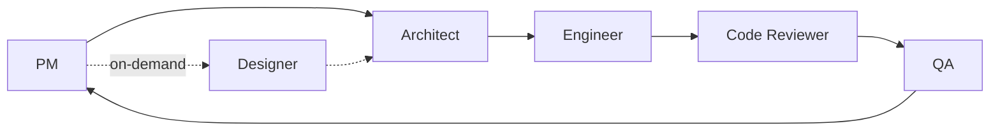

# K-Line Prediction

> One operator. Six AI agents. Every feature leaves a doc trail.
>
> A production-grade showcase of Human × Claude Code autonomous development — where PM, Architect, Engineer, Reviewer, QA, and Designer agents collaborate end-to-end. The K-Line prediction tool is the vehicle; the pipeline is the point.

[](https://vitejs.dev/)
[](https://fastapi.tiangolo.com/)
[](https://firebase.google.com/)
[](https://playwright.dev/)

---

## AI Collaboration Flow

### The 6-Role Autonomous Pipeline

Every feature is developed through a six-role pipeline with automatic handoffs — no manual confirmation between roles:



<!-- ROLES:start -->
| Role | Owns | Artefact |
|---|---|---|
| PM | Requirements, AC, Phase Gates | PRD.md, docs/tickets/K-XXX.md |
| Architect | System design, cross-layer contracts | docs/designs/K-XXX-*.md |
| Engineer | Implementation, stable checkpoints | commits + ticket retrospective |
| Reviewer | Code review, Bug Found Protocol | Review report + Reviewer 反省 |
| QA | Regression, E2E, visual report | Playwright results + docs/reports/*.html |
| Designer | Pencil MCP, flow diagrams | .pen file + get_screenshot output |
<!-- ROLES:end -->

### Verifiability — No Artifact, No Handoff

Every role must produce a verifiable artifact before the next role begins. Audit any ticket's completeness with a single command:

```bash
./scripts/audit-ticket.sh K-XXX
```

Checks A–G: ticket frontmatter, AC coverage, design doc, commit trail, code review, per-role retrospectives, Playwright + visual report output.

### Bug Found Protocol

When a bug is found, four steps must be completed before the fix is released. Skipping any step means the protocol is not closed:

1. **Reflect** — The responsible role diagnoses the root cause and explains why their process failed to catch it. Generic answers ("communicate better") are rejected.
2. **PM confirms** — PM reviews the reflection for: concrete root cause, structural explanation of why the process failed, and a verifiable improvement action.
3. **Write memory** — The conclusion is written into `MEMORY.md` + a dedicated feedback file, and the responsible role's persona is edited. This is the only mechanism that prevents recurrence across sessions.
4. **Fix released** — Only after steps 1–3 pass does the fix proceed, and the ticket retrospective is updated.

**Example — K-008 W4: env var path traversal**

> The Engineer passed `process.env.TICKET_ID` directly into `path.join` as a trusted string. Reviewer flagged it as a filesystem sink. Root cause: trust level was judged by *who provided the input*, not *where it flows*. **Rule codified after fix: sanitize by sink, not by source.** Now embedded in Engineer persona and MEMORY.md.

### Per-Role Retrospective Logs

Each role appends a retrospective entry to its own log file after every ticket (newest at top):

| Role | Log |
|------|-----|
| PM | `docs/retrospectives/pm.md` |
| Architect | `docs/retrospectives/architect.md` |
| Engineer | `docs/retrospectives/engineer.md` |
| Reviewer | `docs/retrospectives/reviewer.md` |
| QA | `docs/retrospectives/qa.md` |
| Designer | `docs/retrospectives/designer.md` |

Single-ticket `## Retrospective` sections record individual events. Per-role logs accumulate behavioral patterns across tickets. Both coexist — neither replaces the other.

**Full protocol document:** [`docs/ai-collab-protocols.md`](docs/ai-collab-protocols.md)

---

## The Product — K-Line Prediction Tool

The system uses an ETH/USDT K-line pattern similarity prediction tool as the concrete vehicle for the collaboration pipeline:

1. User uploads recent OHLC data (CSV, JSON, manual entry, or example data)
2. Calculates candlestick shape features (body%, wick%, return%)
3. Filters historical similar segments using MA99 trend direction as a gate
4. Computes a projected 72-hour price path (median OHLC)
5. Displays win rate, highest/lowest extremes, and per-day statistics

### Frontend Routes (5-page SPA)

| Path | Description |
|------|-------------|
| `/` | Home: Hero + pipeline overview + Dev Diary preview |
| `/app` | Main feature: K-Line prediction interface |
| `/about` | Portfolio page (recruiter-facing) |
| `/diary` | Development diary timeline |
| `/business-logic` | JWT-protected trading logic page |

---

## Technical Architecture

### Tech Stack

| Layer | Technology |
|-------|-----------|
| Frontend | TypeScript + React + Recharts + lightweight-charts + Vite + react-router-dom |
| Backend | Python + FastAPI + PyJWT |
| Tests (FE) | Vitest + Playwright |
| Tests (BE) | pytest |
| Hosting | Firebase Hosting (SPA) + Google Cloud Run (Backend) |

### API Endpoints

| Method | Path | Description |
|--------|------|-------------|
| `POST` | `/api/predict` | Main prediction: OHLC → similar segments + statistics |
| `POST` | `/api/merge-and-compute-ma99` | Pre-compute MA99 (before enabling Predict button) |
| `POST` | `/api/upload-history` | Extend history database via CSV upload |
| `GET` | `/api/history-info` | History database summary |
| `GET` | `/api/example` | Fetch example input from history |
| `POST` | `/api/auth` | Password verification → JWT token |
| `GET` | `/api/business-logic` | JWT-protected content |

### Data Flow

```
User inputs OHLC
  → OHLCEditor (frontend)
  → POST /api/merge-and-compute-ma99
  → POST /api/predict
      → find_top_matches()       [predictor.py]
          ├─ candle feature vector
          ├─ normalized similarity score
          ├─ MA99 trend direction (30-day Pearson)
          └─ Top-N similar segments + 1D aggregation
      → compute_stats()
  → MainChart + MatchList + StatsPanel
```

**Stats split (TD-008 Option C):**
- Full-set stats → computed by backend (`/api/predict` response)
- Subset stats (when user deselects matches) → frontend pure function, zero round-trip
- Both implementations are locked against drift by `backend/tests/fixtures/stats_contract_cases.json`

### Deployment Architecture

```
Browser
  ├── Firebase Hosting  ← SPA static assets (frontend/dist/)
  │     rewrites: ** → /index.html
  └── Google Cloud Run  ← Docker container
        Two-stage build: Node 20 builds frontend → Python 3.11 serves
        ENV: BUSINESS_LOGIC_PASSWORD, JWT_SECRET, PORT
```

---

## Local Development

**Requirements:** Node 20+, Python 3.11+

```bash
# Backend
cd backend
export BUSINESS_LOGIC_PASSWORD=<your-password>
export JWT_SECRET=<your-secret>
python3 -m uvicorn main:app --reload --port 8000

# Frontend (separate terminal)
cd frontend
npm install
npm run dev
```

Frontend at `http://localhost:5173`, backend at `http://localhost:8000`.

---

## Deployment

```bash
# Firebase Hosting (frontend)
cd frontend && npm run build
cd .. && firebase deploy --only hosting

# Cloud Run (backend)
docker build -t k-line-prediction .
gcloud run deploy k-line-prediction \
  --image k-line-prediction \
  --set-env-vars BUSINESS_LOGIC_PASSWORD=xxx,JWT_SECRET=xxx \
  --allow-unauthenticated
```

---

## Testing

```bash
# Frontend unit tests (Vitest)
cd frontend && npm test -- --run

# E2E (Playwright) — auto-starts Vite dev server, mocks API via page.route(), no backend needed
cd frontend && npx playwright install chromium && npm run test:e2e

# Backend (pytest)
cd backend && python3 -m pytest tests/ -v

# Visual report
cd frontend && TICKET_ID=K-021 npx playwright test visual-report.ts
# Output: docs/reports/K-XXX-visual-report.html
```

---

## Future Enhancements

Two areas of active development, ordered by priority:

**Design System Completion** — The v2 global design system rollout surfaced gaps across routes: missing section spacing, incomplete dark-theme palette migration on `/about` components, and `/app` needing isolation as a focused tool viewport (no NavBar/Footer, dedicated background). Closing these ensures visual consistency matches the design spec across all five routes.

**Architecture Refinement** — Two structural improvements in the backlog: (1) decouple frontend and backend stats implementations — backend owns full-set computation, frontend handles subset-on-deselect locally, both locked by a contract test (`stats_contract_cases.json`) to prevent silent divergence; (2) align Playwright spec names to their assertions, so a test named "lock disappears after login" asserts exactly that behavior.

---

## Directory Structure

```
K-Line-Prediction/
├── backend/                ← FastAPI app
│   ├── main.py             ← Route entry + SPA fallback
│   ├── predictor.py        ← Similarity search + MA99 + stats
│   ├── auth.py             ← JWT router
│   ├── models.py           ← Pydantic schemas
│   └── tests/              ← pytest suite (44 predictor + auth + integration)
├── frontend/
│   ├── src/
│   │   ├── pages/          ← 5 page components
│   │   ├── components/     ← Shared + page-specific components
│   │   ├── hooks/          ← usePrediction / useDiary / useAsyncState
│   │   └── utils/          ← api / auth / aggregation / time
│   └── e2e/                ← Playwright specs + visual-report.ts
├── docs/
│   ├── tickets/            ← K-001 ~ latest ticket (each with AC + Retrospective)
│   ├── designs/            ← RFC + ticket design docs
│   ├── retrospectives/     ← Per-role cross-ticket cumulative retrospective logs
│   ├── reports/            ← Playwright visual reports
│   └── ai-collab-protocols.md  ← Public AI collaboration protocol document
├── scripts/
│   └── audit-ticket.sh     ← Ticket audit A–G demo script
├── agent-context/
│   ├── architecture.md     ← Full system architecture document
│   └── conventions.md      ← Naming, pre-commit, time format conventions
├── Dockerfile              ← Two-stage build (Node 20 + Python 3.11)
└── firebase.json
```
